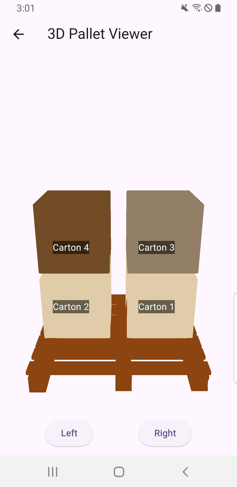

**[Flutter 3D Objects]**

**Features:**
- Displays a 3D model of a pallet with cartons.
- Allows rotating the model left or right.
- Shows labels for the cartons when viewed from specific angles.

**How to use this**
  - Add dependency in pubspec.yaml
  ```yaml
  dependencies:
   flutter:
    sdk: flutter
  flutter_3d_objects:
  ```
  - Add 3D Models in assets, file type should be .obj
  ```yaml
  flutter:
  assets:
  - assets/pallet.obj
  - assets/carton.obj
  ```
  - Use the PalletViewer widget in your application, In PalletViewer we have a Cube, and we add different objects in the scene of the Cube, Cube can have many Childrens.
  - **Scene Creation** The _onSceneCreated method initializes the scene, sets up the camera position, and adds the pallet and cartons to the scene. Here's a breakdown of this method:
      - **Camera Position:** Sets the initial position of the camera.
      - **Pallet Object:** Creates the pallet object and adds child objects (cartons) to it.
      - **Labels:** Adds labels for the cartons to a list for later display.
  - **Rotation** The rotateLeft and rotateRight methods animate the rotation of the pallet. The _animateRotation method uses an AnimationController and a Tween to smoothly rotate the pallet:
      - **AnimationController:** Manages the timing of the animation.
      - **Tween:** Defines the start and end values for the animation.
      - **Listener:** Updates the pallet's rotation and refreshes the scene on each animation frame.
  - **Labels** The _shouldShowLabels method determines if the labels should be shown based on the pallet's rotation. The _buildLabels method creates the label widgets and positions them on the screen. The _calculateScreenPosition method calculates the screen position for each label based on its 3D position.
  - **Object** In the context of flutter_cube, an Object represents a 3D model or a group of 3D models. An Object can have properties such as position, scale, rotation, and it can be composed of other child objects. Here’s an example of how an Object is created and added to the scene:
  ``` dart
  @override
  Widget build(BuildContext context) {
    return Scaffold(
      body: Center(
        child: Cube(
          onSceneCreated: (Scene scene) {
            scene.world.add(
            Object(
            fileName: 'assets/carton.obj',
            position: Vector3(1, 1, 1),
            scale: Vector3(1, 1, 1),
            ),
            );
          },
        ),
      ),
    );
  }
  ```
  - **Vector3** Vector3 is a class representing a 3-dimensional vector. It is used to define the position, scale, and rotation of objects in the 3D space. Each Vector3 instance has three components: x, y, and z.
      - **Position:** Defines where the object is located in the 3D space.
      - **Scale:** Defines the size of the object in the 3D space.
    
  
